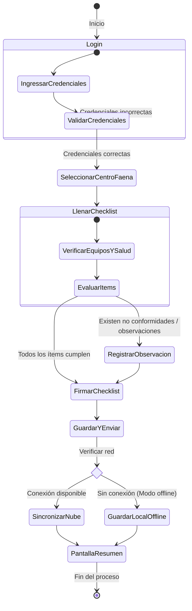

```mermaid
stateDiagram-v2
    [*] --> Login: Inicio

    state Login {
        [*] --> IngressarCredenciales
        IngressarCredenciales --> ValidarCredenciales
    }

    state ValidarCredenciales <<choice>>
    ValidarCredenciales --> SeleccionarCentroFaena: Credenciales correctas
    ValidarCredenciales --> Login: Credenciales incorrectas

    SeleccionarCentroFaena --> LlenarChecklist

    state LlenarChecklist {
        [*] --> VerificarEquiposYSalud
        VerificarEquiposYSalud --> EvaluarItems
    }

    state EvaluarItems <<choice>>
    EvaluarItems --> RegistrarObservacion: Existen no conformidades / observaciones
    EvaluarItems --> FirmarChecklist: Todos los ítems cumplen

    RegistrarObservacion --> FirmarChecklist

    FirmarChecklist --> GuardarYEnviar

    state ValidarConexion <<choice>>
    GuardarYEnviar --> ValidarConexion: Verificar red
    ValidarConexion --> SincronizarNube: Conexión disponible
    ValidarConexion --> GuardarLocalOffline: Sin conexión (Modo offline)

    SincronizarNube --> PantallaResumen
    GuardarLocalOffline --> PantallaResumen

    PantallaResumen --> [*]: Fin del proceso
```
